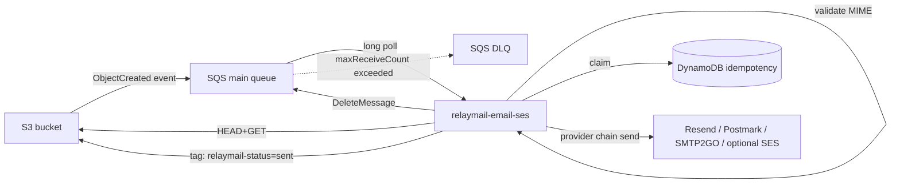
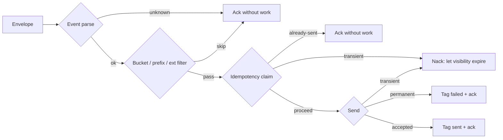
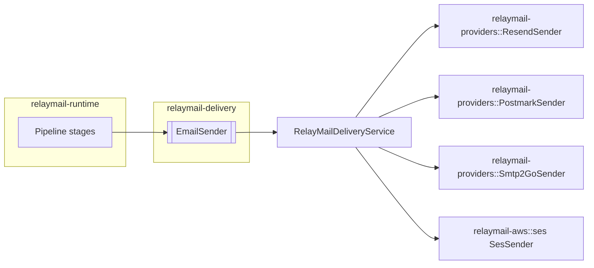

# Architecture

RelayMail is a Rust Cargo workspace of reusable capability crates plus
adapter crates plus one runnable worker. Domain crates never depend on
adapter (AWS SDK, HTTP, framework) types, so future services plug in
without disturbing the core.

## Crate graph

```
relaymail-core <- relaymail-email <- relaymail-delivery
       ^                ^                  ^
       |                |                  |
       +-------- relaymail-aws ------------+
       +-------- relaymail-runtime
       +-------- relaymail-testing
                                  |
                                  v
                apps/relaymail-email-ses  (composition root)
                         |
                         v
                relaymail-providers (REST adapters)
```

Capability traits live in the crate that consumes them. Implementations
live in adapter crates (AWS, testing) and are wired in the binary only.

## Current provider-chain flow



## Failure & retry flow



## Provider architecture



## Future direct MTA architecture

See [future-direct-mta.md](future-direct-mta.md). Short version: the new
`relaymail-direct-mta` service implements `EmailSender` against a
self-managed SMTP stack, and reuses `relaymail-runtime`'s pipeline.

## Observability

- **Logs**: JSON-structured, one event per processed message with
  `service`, `environment`, `tenant_id`, `provider`, `sqs_message_id`,
  `bucket`, key hash, size, idempotency-key hash, provider message id,
  error class. Never the body, never full recipient addresses.
- **Metrics**: Prometheus over `/metrics`. See
  [docs/operations.md](operations.md).
- **Health**: `GET /healthz` (process alive), `GET /readyz` (config +
  AWS clients + pipeline initialized).
