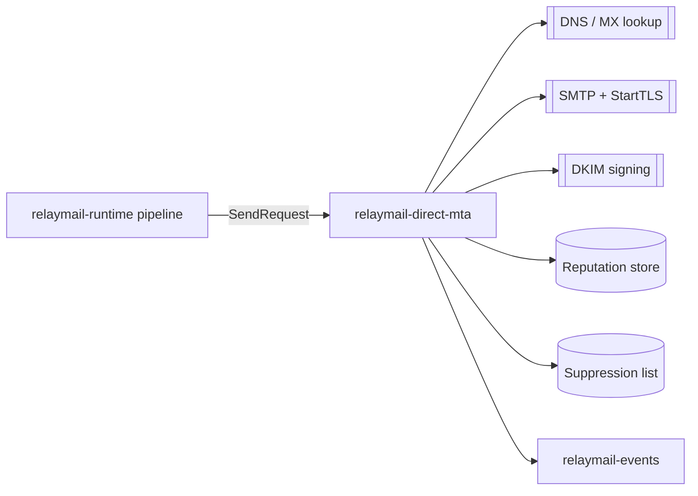

# Future: `relaymail-direct-mta`

`relaymail-direct-mta` is a planned RelayMail service that sends mail
directly over SMTP, without an upstream provider. It is **not** built
in this phase; this document records the intended scope so the monorepo
can grow into it cleanly.

## What it will do

- Accept `SendRequest` from `relaymail-runtime`'s pipeline (same trait
  that the SES sender implements today).
- Resolve recipient MX records, connect over SMTP with StartTLS, and
  deliver.
- Sign outbound mail with DKIM using a configurable key set.
- Track reputation per outbound IP and per destination domain.
- Maintain suppression lists driven by the `relaymail-events` pipeline.
- Retry with domain-aware backoff and permanent/transient
  classification based on the SMTP reply code.

## What it will NOT do

- Leak SMTP or DNS types into `relaymail-core`, `relaymail-email`, or
  `relaymail-delivery`. All SMTP-specific code stays in the
  `relaymail-direct-mta` crate.
- Ship without parity with the SES sender on the observability surface
  — same metric names, same JSON log fields.

## Architecture sketch

## Implementation hints

- Prefer `lettre` for SMTP client plumbing; it handles StartTLS and
  authentication well. Wrap it behind an `EmailSender` impl so the rest
  of the monorepo cannot see its types.
- Put MX/DNS caching in a sibling module, not in the SMTP client — it
  is reusable for health checks.
- Use `tokio_rustls` for TLS so we avoid OpenSSL.
- DKIM: a custom crate or `mail-auth`. Keep the signer pluggable.

## What must happen before implementation starts

- `relaymail-events` is alive enough to feed a suppression list.
- Operational team has a plan for IP warmup and reputation monitoring.
- Compliance reviewed the DKIM key management story.
